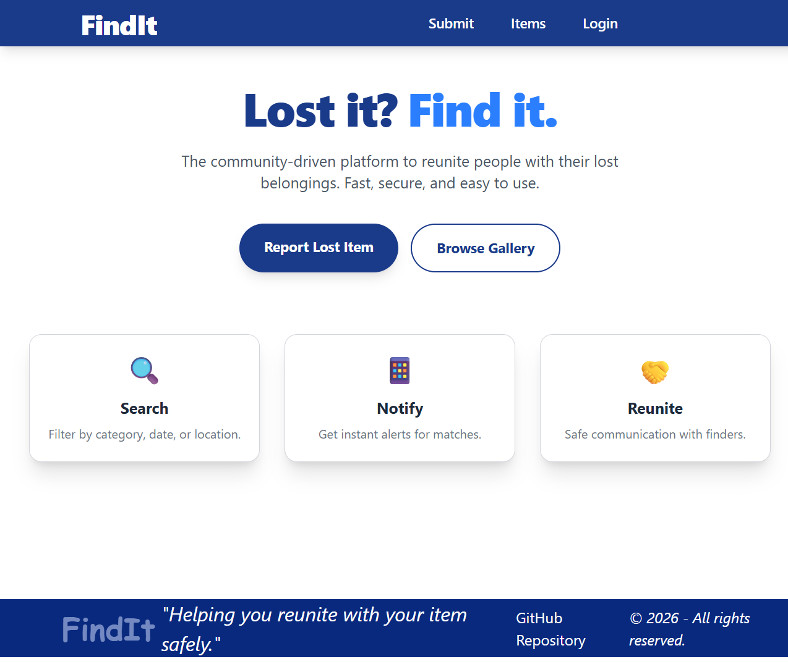
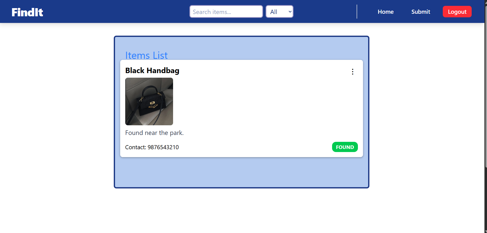
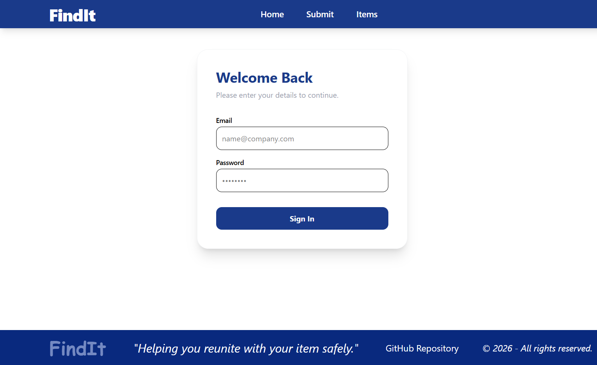

<!-- # Lost & Found Web App - Full Stack Web Application🧭

Lost & Found is a full-stack web application that allows users to report lost or found items, browse listings, and manage item ownership. 

The project follows a scalable full-stack architecture with React (frontend) and Node.js/Express (backend), currently transitioning from a frontend-only MVP to a fully integrated backend system.

## Live Demo
👉 https://lost-and-found-react.vercel.app/

## Features

### Current (Frontend)
- Landing page with navigation
- Submit lost/found items
- View all submitted items
- Search & filter items
- Fake authentication flow (login required for actions)
- Data persistence using localStorage
- Responsive UI with Tailwind CSS
- Client-side routing using React Router

## Image Upload (Work in Progress)

Image upload is temporarily disabled.

Currently the backend does not have a database or file storage service.
Images will be re-enabled once backend is connected to:
- MongoDB (for data)
- Cloud storage (Cloudinary / Firebase / S3)

This is part of the next development phase.

### Planned (Backend)
- Real user authentication (JWT)
- User accounts
- Database storage (MongoDB)
- Image upload (Cloudinary)
- Ownership tracking of items
- Real contact system

## Tech Stack

### Frontend
- React
- React Router DOM
- Tailwind CSS
- Vite
- LocalStorage

### Backend (Planned)
- Node.js
- Express.js
- MongoDB
- JWT Authentication
- Cloudinary (image storage)

## 📂 Project Structure

FINDIT-PROJECT/
│
├── lost-found-React/        # Frontend (React + Vite)
├── lost-found-backend/      # Backend (Node.js + Express)
└── README.md


## Screenshots






## How to Run Locally

```bash
command
```
git clone https://github.com/Farheen-Mulla/lost-and-found-react.git
cd lost-and-found-react
npm install
npm run dev

# 🧠 Project Flow
User lands on public landing page  
Can navigate to submit or items  
Search or submit redirects to login  
After login, full app is accessible  
Items are stored in LocalStorage  

# 🔐 Authentication
Currently implemented using fake auth (frontend only).  
Real authentication will be added in backend phase.  

# 📦 Current Limitations
No real user accounts  
No real database  
Images not persisted after refresh  
Anyone can edit/delete any item  
These will be fixed in backend phase.  

# 🛣 Roadmap
## Phase 1 (Done)
Frontend UI  
Routing  
LocalStorage  
Fake auth  
Deployment  

## Phase 2 (Next)
Node.js + Express backend  
MongoDB database  
Real authentication  
Image upload  
User ownership system  

## 💼 Why I Built This

This project was built to:

- Practice full-stack architecture design
- Implement authentication and ownership systems
- Understand frontend-backend integration
- Learn deployment workflows
- Build a production-style portfolio project  

# 👨‍💻 Author
Farheen Mulla
AI x Full-Stack Developer (in progress)  
LinkedIn: https://www.linkedin.com/in/farheen-mulla-413335335/ -->


# Lost & Found Web App 🧭

Full-Stack Cloud-Deployed Web Application

Lost & Found is a fully deployed full-stack web application that allows users to report lost or found items, browse listings, and manage submissions.

## The project follows a scalable production-style architecture using:

- React (Frontend)
- Node.js + Express (Backend)
- MongoDB Atlas (Database)
- Vercel (Frontend Deployment)
- Render (Backend Deployment)

This project evolved from a frontend-only MVP into a fully integrated cloud-based full-stack system.

---

## 🌍 Live Demo

### Frontend (Vercel):
👉 https://lost-and-found-react.vercel.app/

### Backend (Render):
Connected via secure API (not exposed publicly in README for security).

---

## 🚀 Features

### ✅ Current (Production)

- Responsive landing page
- Submit lost/found items
- View all submitted items
- Persistent database storage (MongoDB Atlas)
- Real backend API integration
- Cloud deployment (Frontend + Backend)
- RESTful API architecture
- Environment variable configuration
- CORS-enabled secure communication
- MVC backend structure
- Clean Git-based deployment workflow

---

### 🔜 Upcoming Enhancements

- JWT Authentication
- User accounts
- Ownership-based item control
- Image upload (Cloudinary integration)
- Advanced search & filtering
- Pagination
- Loading states & better UX feedback

---

## 🧱 Tech Stack

### Frontend

- React
- React Router DOM
- Tailwind CSS
- Vite
- Fetch API

### Backend

- Node.js
- Express.js
- MongoDB Atlas
- Mongoose
- CORS
- dotenv

### Deployment

- Vercel (Frontend Hosting)
- Render (Backend Hosting)
- MongoDB Atlas (Cloud Database)

---

## 🏗 Architecture Overview

```
Users (Browser)
        ↓
Vercel (React Frontend)
        ↓
Render (Node/Express Backend API)
        ↓
MongoDB Atlas (Cloud Database)
```

This mirrors real-world production architecture used in modern SaaS applications.

---

## 📂 Project Structure

FINDIT-PROJECT/
│
├── lost-found-React/        # Frontend (React + Vite)
├── lost-found-backend/      # Backend (Node.js + Express)
└── README.md

---

## 📸 Screenshots


---

## 🔐 Environment Variables

Sensitive credentials such as MongoDB connection strings are stored using environment variables via:

- ".env" (local development)
- Render Dashboard (production)

No secrets are committed to GitHub.

---

## 📦 Current Capabilities

- Persistent data storage (MongoDB Atlas)
- Cloud-hosted backend API
- Fully deployed frontend
- Production-ready configuration
- Clean commit history
- MVC backend structure

---

## 🛣 Development Phases

### ✅ Phase 1 – Frontend MVP (Completed)

- UI development
- Routing
- LocalStorage persistence
- Fake authentication
- Initial deployment

### ✅ Phase 2 – Backend Integration (Completed)

- Express API
- MongoDB Atlas connection
- MVC restructuring
- Environment variable setup
- Render deployment
- Full frontend-backend integration

### 🔜 Phase 3 – Feature Expansion

- JWT Authentication
- Image storage (Cloudinary)
- Authorization middleware
- Production-level validation
- UI/UX improvements

---

## 💼 Why I Built This

This project was built to:

- Practice full-stack architecture design
- Implement frontend-backend integration
- Work with MongoDB Atlas
- Understand environment variables
- Learn production deployment workflows
- Gain hands-on experience with Vercel & Render
- Build a cloud-based portfolio project

---

## 👨‍💻 Author

Farheen Mulla
Full-Stack Developer (in progress)

LinkedIn:
https://www.linkedin.com/in/farheen-mulla-413335335/

---

⭐ If you found this project helpful, feel free to star the repository.