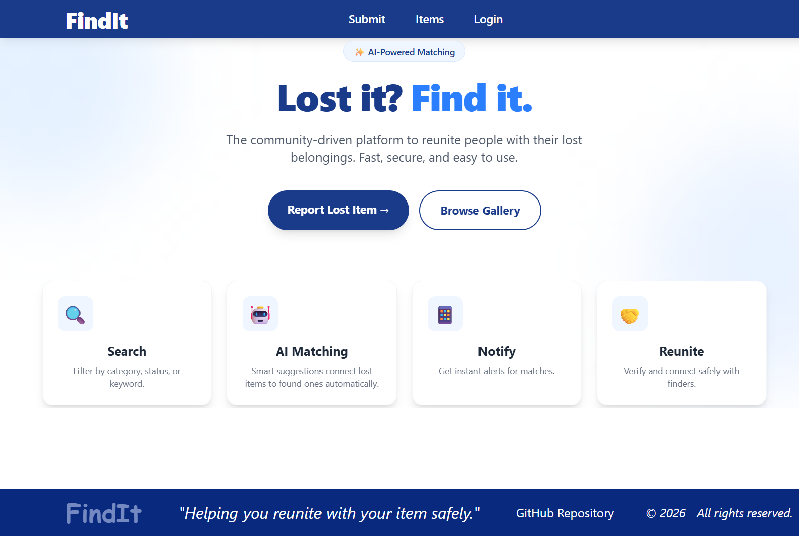
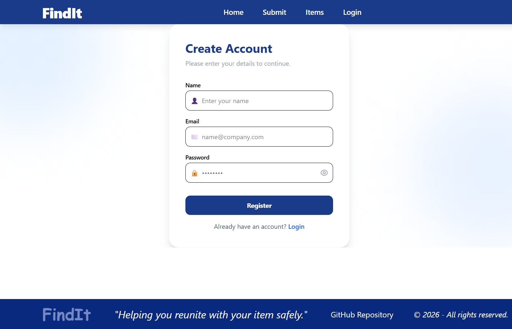
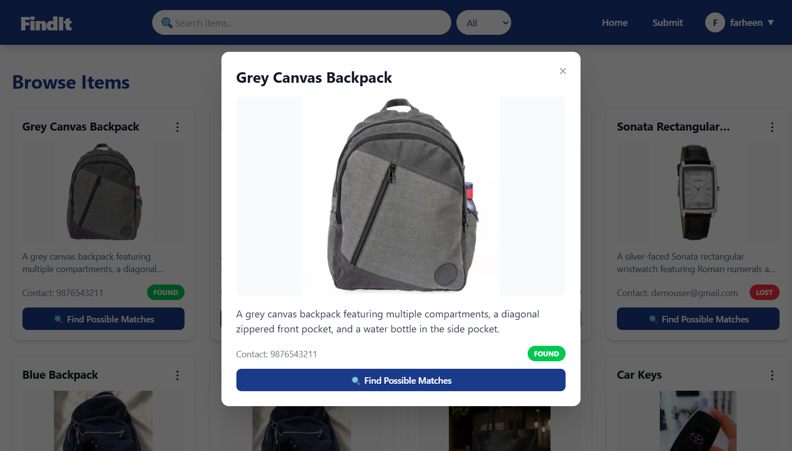

# 🧭 FindIt – AI-Powered Lost & Found Platform


**FindIt** is a full-stack AI-powered Lost & Found platform that helps users report, discover, and manage lost or found items. Built with the MERN stack, it combines secure authentication, cloud image storage, semantic AI search, and intelligent ownership verification to create a smarter lost-and-found experience.

---

## 🌐 Live Demo

**Frontend:** https://findit-platform.vercel.app/

**Backend API:** https://lost-found-backend-ajdo.onrender.com

---

# ✨ Features

### 🔐 Authentication & Security
- User Registration & Login
- JWT Authentication
- Protected Routes
- Password Hashing using bcrypt
- User-specific item management

### 📦 Item Management
- Report Lost or Found Items
- Edit & Delete Your Listings
- Upload Images via Cloudinary
- View All Items
- Responsive UI

### 🤖 AI Features

#### 🔍 Semantic Search
Instead of relying on simple keyword matching, FindIt uses **vector embeddings** and **cosine similarity** to understand the meaning behind search queries, helping users discover relevant items even when different words are used.

#### 🧠 AI Ownership Verification
When an item is reported, **Google Gemini** generates a unique verification question based on the item's description. This helps verify genuine ownership by asking about details that only the real owner is likely to know.

Example:

> Item: Black Wallet

AI-generated question:

> *"What distinguishing mark is present on the wallet?"*

This adds an intelligent verification layer to reduce false ownership claims.

---

# 🛠 Tech Stack

| Category | Technologies |
|----------|--------------|
| Frontend | React, Vite, Tailwind CSS, React Router |
| Backend | Node.js, Express.js |
| Database | MongoDB Atlas, Mongoose |
| Authentication | JWT, bcrypt |
| AI | Google Gemini API, Embeddings, Cosine Similarity |
| Image Storage | Cloudinary, Multer |
| Deployment | Vercel, Render |

---

# 🏗️ Architecture

```
                React + Vite
                      │
                      ▼
             Express REST API
                      │
      ┌───────────────┼───────────────┐
      ▼               ▼               ▼
 MongoDB Atlas   Cloudinary      AI Services
                                    │
                     ┌──────────────┴──────────────┐
                     ▼                             ▼
              Semantic Search          Gemini Verification
```

---

# 📂 Project Structure

```
FindIt/
│
├── frontend/
│   ├── src/
│   ├── public/
│   └── package.json
│
├── backend/
│   ├── controllers/
│   ├── middleware/
│   ├── models/
│   ├── routes/
│   ├── utils/
│   ├── config/
│   └── package.json
│
└── README.md
```

---

# ⚙️ Installation

### Clone Repository

```bash
git clone https://github.com/Farheen-Mulla/FindIt.git
cd FindIt
```

### Backend

```bash
cd backend
npm install
npm start
```

### Frontend

```bash
cd frontend
npm install
npm run dev
```

---

# 🔑 Environment Variables

### Backend (.env)

```env
MONGODB_URI=
JWT_SECRET=
GEMINI_API_KEY=

CLOUDINARY_CLOUD_NAME=
CLOUDINARY_API_KEY=
CLOUDINARY_API_SECRET=
```

### Frontend (.env)

```env
VITE_API_URL=
```

---

# 📸 Screenshots

- 🏠 
- 🔐 
- 🔐 
- 📦 
- 📦 
- ➕ 


---

# 🚀 Future Enhancements

- 📍 Location-based search
- 💬 Real-time messaging between users
- 🔔 Email notifications
- 📱 Progressive Web App (PWA)
- 🖼️ Image similarity search
- 🛡️ Admin dashboard
- 📊 Analytics Dashboard

---

# 💡 Why This Project?

FindIt was built to gain hands-on experience with production-ready full-stack development while exploring practical AI integration. The project combines authentication, cloud services, REST APIs, semantic search, and generative AI to solve a real-world problem using modern web technologies.

---

# 👨‍💻 Author

**Farheen Mulla**

- GitHub: https://github.com/Farheen-Mulla
- LinkedIn: https://www.linkedin.com/in/farheen-mulla-413335335/

---

## ⭐ Show Your Support

If you found this project interesting, consider giving it a **⭐ Star** on GitHub. It helps others discover the project and supports my work!

---
**Built with ❤️ using the MERN Stack + Google Gemini AI**