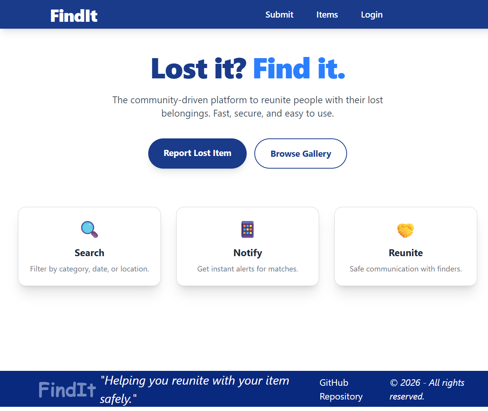
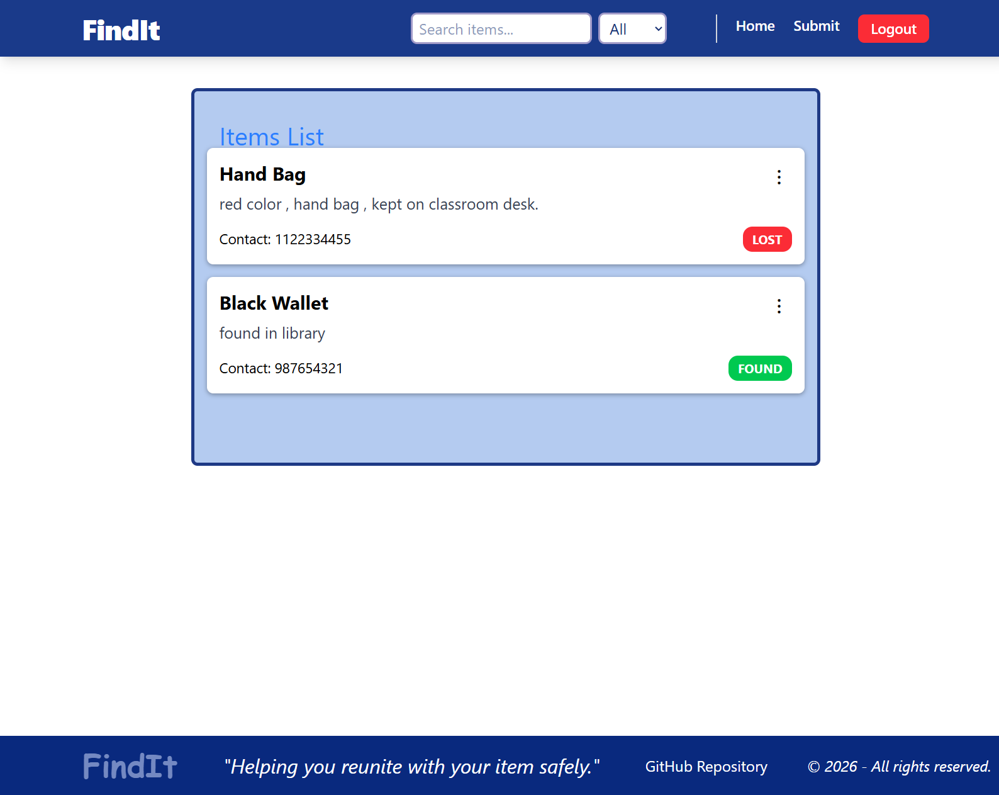
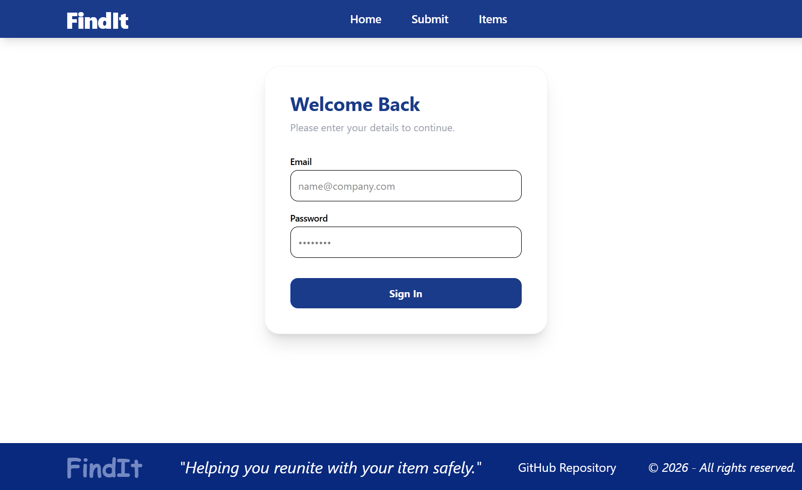

# Lost & Found Web App 🧭

A full-stack Lost & Found web application where users can post lost or found items, search through listings, and contact item owners.  
Currently built with React on the frontend and will be extended with a backend (Node.js, Express, MongoDB).

## Live Demo
👉 https://lost-and-found-react.vercel.app/

## Features

### Current (Frontend)
- Landing page with navigation
- Submit lost/found items
- View all submitted items
- Search & filter items
- Fake authentication flow (login required for actions)
- Data persistence using localStorage
- Responsive UI with Tailwind CSS
- Client-side routing using React Router

## Image Upload (Work in Progress)

Image upload is temporarily disabled.

Currently the backend does not have a database or file storage service.
Images will be re-enabled once backend is connected to:
- MongoDB (for data)
- Cloud storage (Cloudinary / Firebase / S3)

This is part of the next development phase.

### Planned (Backend)
- Real user authentication (JWT)
- User accounts
- Database storage (MongoDB)
- Image upload (Cloudinary)
- Ownership tracking of items
- Real contact system

## Tech Stack

### Frontend
- React
- React Router DOM
- Tailwind CSS
- Vite
- LocalStorage

### Backend (Planned)
- Node.js
- Express.js
- MongoDB
- JWT Authentication
- Cloudinary (image storage)

## Screenshots

## How to Run Locally

bash:
git clone https://github.com/Farheen-Mulla/lost-and-found-react.git
cd lost-and-found-react
npm install
npm run dev

# 🧠 Project Flow
User lands on public landing page  
Can navigate to submit or items  
Search or submit redirects to login  
After login, full app is accessible  
Items are stored in LocalStorage  

# 🔐 Authentication
Currently implemented using fake auth (frontend only).  
Real authentication will be added in backend phase.  

# 📦 Current Limitations
No real user accounts  
No real database  
Images not persisted after refresh  
Anyone can edit/delete any item  
These will be fixed in backend phase.  

# 🛣 Roadmap
## Phase 1 (Done)
Frontend UI  
Routing  
LocalStorage  
Fake auth  
Deployment  

## Phase 2 (Next)
Node.js + Express backend  
MongoDB database  
Real authentication  
Image upload  
User ownership system  

# 💼 Why I Built This
This project is built for:  
Learning full-stack development  
Portfolio / resume  
Real-world React architecture  
Deployment workflow  

# 👨‍💻 Author
Farheen Mulla
AI x Full-Stack Developer (in progress)  
LinkedIn: https://www.linkedin.com/in/farheen-mulla-413335335/